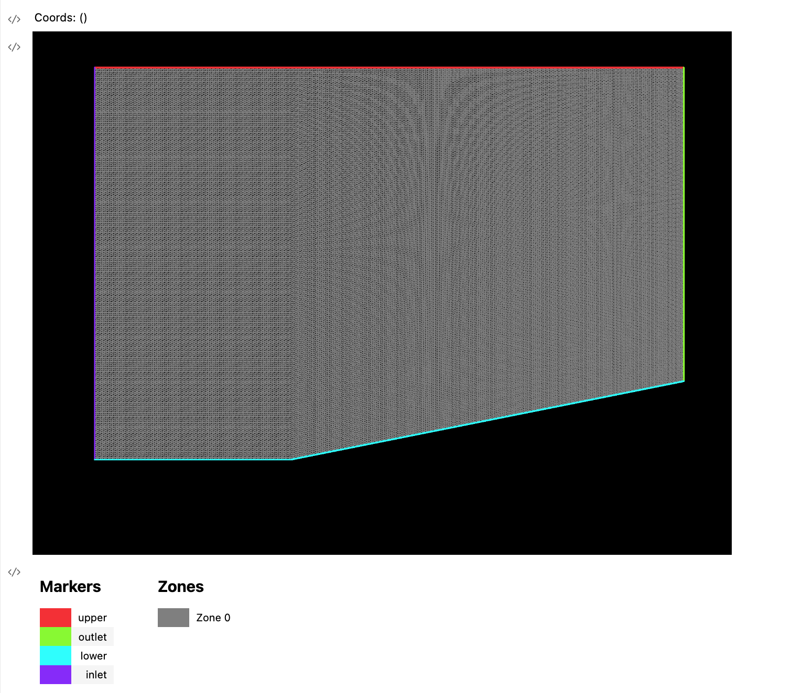

<h1 align="center">🕸️ ezmesh</h1>

<p align="center">the open source parametric CFD mesh generator</p>

<p align="center">
    <a href="https://discord.gg/H7qRauGkQ6">
        
    </a>
    <a href="https://www.patreon.com/turbodesigner">
        
    </a>
</p>


# About
ezmesh is a declarative tool that parametrically generates meshes compliant with a variety of mesh formats with easy and configurable API on top of GMSH.


# Install
## Latest
```
pip install git+https://github.com/Turbodesigner/ezmesh.git#egg=ezmesh
```

## Other Versions
```
# Version 2
pip install git+https://github.com/Turbodesigner/ezmesh.git@2.0.0#egg=ezmesh

# Version 1
pip install git+https://github.com/Turbodesigner/ezmesh.git@1.0.0#egg=ezmesh
```

# Example
See more examples in [examples](/examples) directory
## Inviscid Wedge
```python
from ezmesh import CurveLoop, PlaneSurface, TransfiniteSurfaceField, TransfiniteCurveField, Geometry, visualize_mesh
import numpy as np

with Geometry() as geo:
    wedge_coords = np.array([[0, 1], [1.5, 1], [1.5, 0.2], [0.5, 0], [0, 0]])
    
    wedge_curve_loop = CurveLoop.from_coords(
        wedge_coords, 
        mesh_size = 0.05,
        labels=["upper", "outlet", "lower/1", "lower/2", "inlet"],
        fields=[
           TransfiniteCurveField(node_counts=[150,200,100,50,200])
        ]
    )
    surface = PlaneSurface(
        outlines=[wedge_curve_loop],
        is_quad_mesh=True,
        fields=[
            TransfiniteSurfaceField(corners=[
                *wedge_curve_loop.get_points("upper"), 
                *wedge_curve_loop.get_points("lower")
            ])
        ]
    )
    mesh = geo.generate(surface)
    visualize_mesh(mesh)
    geo.write("mesh_wedge_inv.su2")
```

## Visualize Mesh
```python
from ezmesh import import_from_file
from ezmesh import visualize_mesh
mesh = import_from_file("mesh_wedge_inv.su2")
visualize_mesh(mesh)
```



# Devlopement Setup
```
git clone https://github.com/Turbodesigner/ezmesh.git
cd ezmesh
pip install -r requirements_dev.txt
```

# Help Wanted
Right now there are some items such as more CFD meshing configurations. Please join the [Discord](https://discord.gg/H7qRauGkQ6) for project communications and collaboration. Please consider donating to the [Patreon](https://www.patreon.com/turbodesigner) to support future work on this project.

