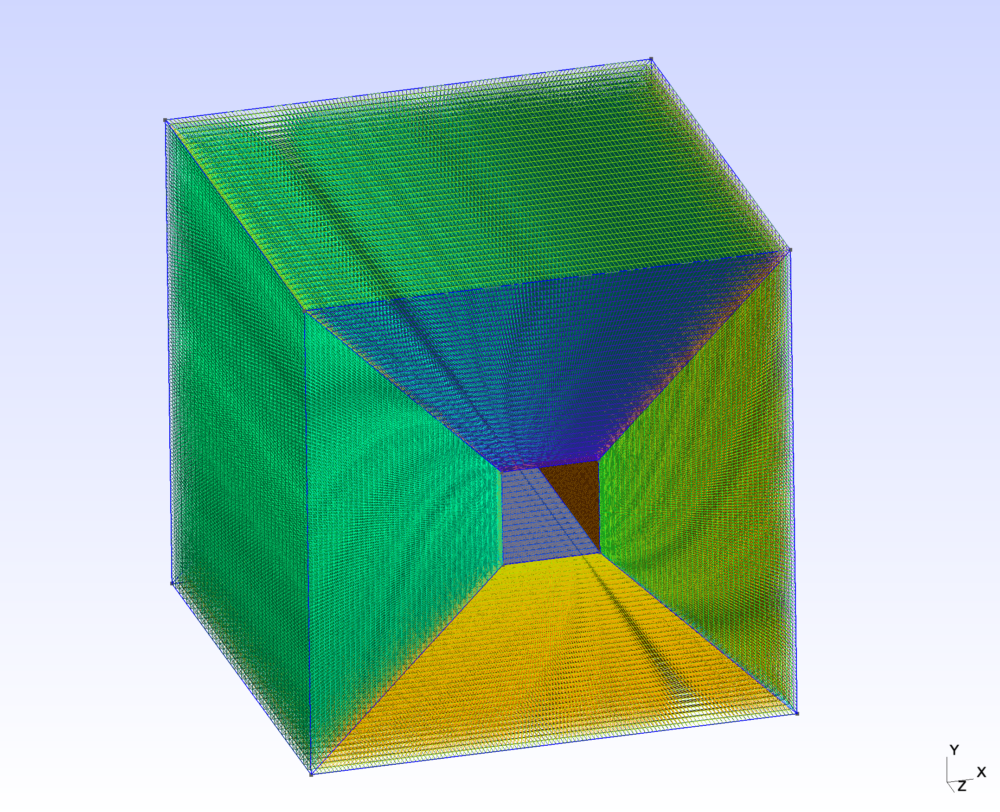

<h1 align="center">🕸️ meshql</h1>

<p align="center">the open source parametric CFD mesh generator</p>

<p align="center">
    <a href="https://discord.gg/H7qRauGkQ6">
        
    </a>
    <a href="https://www.patreon.com/openorion">
        
    </a>
</p>


# About
meshql is a declarative tool that parametrically generates meshes compliant with a variety of mesh formats with easy and configurable API on top of GMSH. This release is REALLY alpha. Use at your own risk.


# Install
```
pip install git+https://github.com/OpenOrion/meshql.git#egg=meshql
```


# Example
See more examples in [examples](/examples) directory
## Cube
```python
import cadquery as cq
from meshql import GeometryQL, Split

with GeometryQL() as geo:
    (
        geo
        .load(
            (
                cq.Workplane("XY")
                .box(10,10,10)
                .rect(2, 2)
                .cutThruAll()
            ),
            splits= lambda workplane: [
                Split.from_plane(angle=(90,90,0)),
                Split.from_plane(angle=(-90,90,0)),
            ],
            use_cache=True
        )
        .setTransfiniteAuto(max_nodes=300)
        .generate(3)
        .show("gmsh")
    )


```




# Developement Setup
```
git clone https://github.com/OpenOrion/meshql.git
cd meshql
pip install -r requirements_dev.txt
```

# Help Wanted
Please join the [Discord](https://discord.gg/H7qRauGkQ6) for project communications and collaboration. Please consider donating to the [Patreon](https://www.patreon.com/openorion) to support future work on this project.

